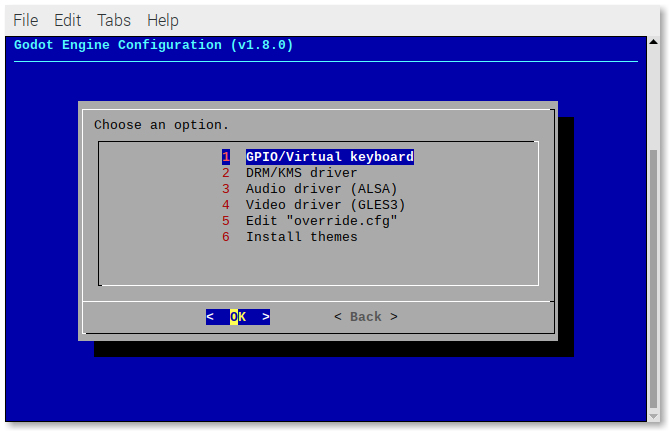

# RetroPie Sunvox Engine "Emulator"

 

A scriptmodule to install a Sunvox "emulator" for RetroPie.

## Table of contents

- [RetroPie Sunvox Engine "Emulator"](#retropie-sunvox-engine-emulator)
  - [Table of contents](#table-of-contents)
  - [🛠️ Setup script](#️-setup-script)
    - [Install the script](#install-the-script)
    - [Update the script](#update-the-script)
  - [🚀 Usage](#-usage)
  - [📖 Options](#-options)
  - [Install the Sunvox "emulator" from RetroPie-Setup](#install-the-sunvox-emulator-from-retropie-setup)
  - [Uninstall the Sunvox "emulator" from RetroPie-Setup](#uninstall-the-sunvox-emulator-from-retropie-setup)
  - [Update the Sunvox "emulator" from RetroPie-Setup](#update-the-sunvox-emulator-from-retropie-setup)
  - [Using a GPIO/Virtual keyboard](#using-a-gpiovirtual-keyboard)
    - [Add/Remove a GPIO/Virtual keyboard](#addremove-a-gpiovirtual-keyboard)
  - [ℹ️ Troubleshooting](#ℹ️-troubleshooting)
  - [👤 Author](#-author)

## 🛠️ Setup script

### Install the script

```
cd ~
git clone https://github.com/itsdarklikehell/RetroPie-Sunvox.git
cd RetroPie-Sunvox/
sudo chmod +x setup-sunvox-scriptmodule.sh
```

### Update the script

```
cd ~/RetroPie-Sunvox/
git pull
```

## 🚀 Usage

```
./setup-sunvox-scriptmodule.sh [OPTIONS]
```

If no options are passed, you will be prompted with a usage example:

```
USAGE: ./setup-sunvox-scriptmodule.sh [OPTIONS]

Use '--help' to see all the options.
```

The script assumes that you are running it on a Raspberry Pi with the `RetroPie-Setup` folder being stored in `~/RetroPie-Setup`. If your setup differs, you can pass the path where your `RetroPie-Setup` folder is stored as a parameter, like this:

```
./setup-sunvox-scriptmodule.sh [OPTION] "/path/to/your/RetroPie-Setup"
```

## 📖 Options

- `--help`: Prints the help message and exit.
- `--version`: Shows the script version.
- `--install [path]`: Installs the `sunvox` scriptmodule.
  - Path: The location of the `RetroPie-Setup` folder.
  - Default: `~/RetroPie-Setup`.
- `--uninstall [path]`: Uninstalls the `sunvox` scriptmodule.
  - Path: The location of the `RetroPie-Setup` folder.
  - Default: `~/RetroPie-Setup`.
- `--update [path]`: Updates the `sunvox` scriptmodule.
  - Path: The location of the `RetroPie-Setup` folder.
  - Default: `~/RetroPie-Setup`.

## Install the Sunvox "emulator" from RetroPie-Setup

Once you've successfully installed the scriptmodule, run:

```
sudo ~/RetroPie-Setup/retropie_setup.sh
```

Go to:

- Manage packages
- Manage optional packages
- sunvox
- Install from source

The script installs the latest versions of Sunvox:

- `2.1.2`

A new `sunvox` folder will be created in `~/RetroPie/roms`, where you can [install the Sunvox games](#how-to-install-sunvox-games) using the `.sunvox` and `.zip` extensions.

## Uninstall the Sunvox "emulator" from RetroPie-Setup

Run:

```
sudo ~/RetroPie-Setup/retropie_setup.sh
```

Go to:

- Manage packages
- Manage optional packages
- sunvox
- Remove

## Update the Sunvox "emulator" from RetroPie-Setup

Before updating the "emulator", you must update the **setup script** and the **scriptmodule**.

Run:

```
# Update the setup script.
cd ~/RetroPie-Sunvox/
git pull
# Update the scriptmodule.
./setup-sunvox-scriptmodule.sh --update
```

Then, to update the Sunvox "emulator", run:

```
sudo ~/RetroPie-Setup/retropie_setup.sh
```

Go to:

- Manage packages
- Manage optional packages
- sunvox
- Update from source

## Using a GPIO/Virtual keyboard

> ⚠️ When using a GPIO/Virtual keyboard, the actual keyboard won't work anymore. But you can always remove the GPIO/Virtual keyboard (see below).

As of **v1.2.0**, when using the **FRT** "emulator", you can use a GPIO/Virtual keyboard, such as [GPIOnext](https://github.com/mholgatem/GPIOnext) or [Adafruit's Retrogame](https://github.com/adafruit/Adafruit-Retrogame).

### Add/Remove a GPIO/Virtual keyboard

Run:

```
sudo ~/RetroPie-Setup/retropie_setup.sh
```

and then go to:

- Configuration/tools
- sunvox

Select **GPIO/Virtual keyboard**.



You will be prompted with a menu showing all the results from the command `cat /proc/bus/input/devices`. Select the GPIO/Virtual keyboard that you want.

If you want to to reverse that action, follow the same steps and select **None**.

## ℹ️ Troubleshooting

## 👤 Author

**itsdarklikehell**

- Twitter: [@itsdarklikehell](https://twitter.com/itsdarklikehell)
- GitHub: [@itsdarklikehell](https://github.com/itsdarklikehell)
